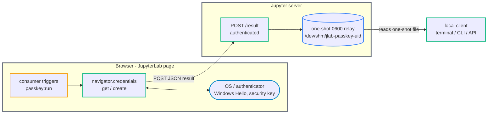

# jupyterlab_passkey_extension

[](https://github.com/stellarshenson/jupyterlab_passkey_extension/actions/workflows/build.yml)
[](https://www.npmjs.com/package/jupyterlab_passkey_extension)
[](https://pypi.org/project/jupyterlab-passkey-extension/)
[](https://pepy.tech/project/jupyterlab-passkey-extension)
[](https://jupyterlab.readthedocs.io/en/stable/)
[](https://kolomolo.com)
[](https://www.paypal.com/donate/?hosted_button_id=B4KPBJDLLXTSA)

A generic passkey bridge for JupyterLab. It exposes the passkey (WebAuthn) capability of the user's browser or operating system to local clients that have no browser of their own - the JupyterLab terminal and the CLI or API clients running on the Jupyter server. The extension runs the browser-side ceremony and hands the result back to the requesting local process.

It is purpose-agnostic and performs no cryptography of its own. Every caller supplies its own parameters, and the extension holds no secret. A vault that unlocks with a passkey, a CLI that needs a WebAuthn PRF value, or any tool that wants a signed assertion is just a consumer - the key handling stays in the consumer, never here.

## How it works

A browser page can only talk back to the Jupyter server over HTTP. A terminal or CLI process on the server cannot receive anything from the page directly. So the ceremony runs in the page, and its result returns through a small authenticated server endpoint that writes a one-shot relay file the local client reads.



## The interface

### Frontend command `passkey:run`

One command runs a ceremony and POSTs the result. It reaches `navigator.credentials.*` before any `await`, so a trigger's user gesture (for example a notification button click) survives into the ceremony.

| Argument   | Op     | Description                                                                |
| ---------- | ------ | -------------------------------------------------------------------------- |
| `op`       | both   | `"get"` to assert an existing credential, `"create"` to register a new one |
| `nonce`    | both   | correlation key and relay filename; must match `[A-Za-z0-9_-]{16,128}`     |
| `rp_id`    | both   | WebAuthn Relying Party ID; normally the page hostname                      |
| `cred_id`  | get    | base64url credential id to assert                                          |
| `prf_salt` | get    | base64url 32-byte salt; evaluates the WebAuthn PRF (hmac-secret) extension |
| `user`     | create | `{ id, name, displayName }` for the new credential (`id` is base64url)     |

The challenge is a random 32-byte value the frontend generates itself - it is anti-replay plumbing that nothing here verifies, so callers never supply it.

### Result shapes

The frontend POSTs one of these JSON bodies to the server, keyed by `nonce`:

```jsonc
// create success
{ "nonce": "...", "ok": true, "cred_id": "<b64url>", "prf_enabled": false }

// get success (prf present only when prf_salt was supplied and evaluated)
{ "nonce": "...", "ok": true, "cred_id": "<b64url>", "prf": "<b64url>" }

// failure
{ "nonce": "...", "ok": false, "error": "no-prf" | "not-allowed" | "error" }
```

`create` never rejects on the create-time PRF flag - it always returns `cred_id` and a plain `prf_enabled`. Some authenticators (Windows Hello) report `prf_enabled: false` at registration yet yield a real PRF at assertion, so PRF availability is confirmed by a follow-up `get` with a `prf_salt`. `not-allowed` is WebAuthn's deliberate conflation of user-cancel, no-matching-credential, and wrong-RP into one privacy-preserving code.

### Server endpoints

Both live under the server base URL and require Jupyter authentication.

- `POST <base_url>/jupyterlab-passkey-extension/result` - validates the nonce, writes the body to a one-shot `0600` relay, returns `204`. The body, including any PRF value, is never logged
- `GET <base_url>/jupyterlab-passkey-extension/health` - returns `{ "ok": true }`

The relay directory defaults to the uid-scoped `/dev/shm/jlab-passkey-<uid>` and is overridable with the `JLAB_PASSKEY_RELAY_DIR` environment variable.

## Triggering a ceremony

WebAuthn requires a user gesture, and this extension builds no request-submission UI of its own - that is the consumer's job. The reference trigger is a [jupyterlab-notify](https://pypi.org/project/jupyterlab-notify/) notification whose action button is bound to `passkey:run`; clicking it supplies the gesture and reaches the command with the app already in hand.

```bash
jupyterlab-notify --now --no-auto-close -t info \
  -m "Approve passkey" \
  --action "Approve" \
  --cmd "passkey:run" \
  --command-args '{"op":"get","nonce":"<16-128 url-safe chars>","rp_id":"your.host","cred_id":"<b64url>","prf_salt":"<b64url>"}'
```

The local client then reads `<relay_dir>/<nonce>.json` to collect the result.

> [!NOTE]
> Do not start JupyterLab with `--expose-app-in-browser` just to trigger the command by hand. A notify button (or any extension that holds the app reference) reaches `passkey:run` directly with a genuine gesture and no global.

See [docs/example-secret-unlock.md](docs/example-secret-unlock.md) for a four-step consumer walkthrough that unlocks a secret with a passkey.

## Security

- Both endpoints are gated by `@tornado.web.authenticated` - a caller needs the Jupyter token or session
- The relay is created with `mkstemp` + `os.replace`, giving a fresh `0600` file with no world-readable window, then renamed onto `<nonce>.json` so it is one-shot
- The relay directory is uid-scoped, so a co-tenant sharing `/dev/shm` cannot pre-create or squat the path
- The result body and any PRF value are never written to logs
- The extension performs no cryptography and stores no secret; every parameter and all key handling belong to the caller

## Requirements

- JupyterLab >= 4.0.0
- A consumer to trigger `passkey:run` (for example `jupyterlab-notify`) and a local client to read the relay

## Install

```bash
pip install jupyterlab_passkey_extension
```

## Manual end-to-end test

`scripts/passkey_selftest.py` drives the real trigger against your own authenticator: it sends the notify button, runs `create` then `get`, and verifies the relay the server writes (the PRF value is redacted, never printed).

```bash
python scripts/passkey_selftest.py --rp-id your.jupyterlab.host
```

## Development install

```bash
# from a clone of this repository
pip install -e "."
jupyter labextension develop . --overwrite
jlpm build
```

Rebuild after changes with `jlpm build`, or run `jlpm watch` in one terminal alongside JupyterLab. See [CONTRIBUTING.md](CONTRIBUTING.md) for the full development, testing, and release workflow.

## Uninstall

```bash
pip uninstall jupyterlab_passkey_extension
```

## License

BSD-3-Clause. See [LICENSE](LICENSE).
