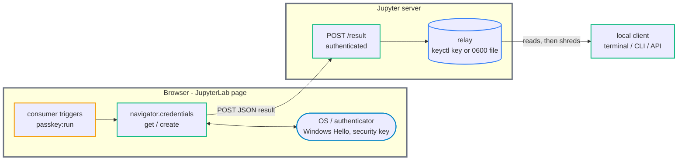
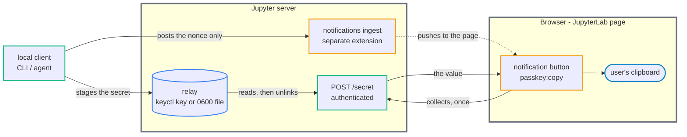

# jupyterlab_passkey_extension

[](https://github.com/stellarshenson/jupyterlab_passkey_extension/actions/workflows/build.yml)
[](https://www.npmjs.com/package/jupyterlab_passkey_extension)
[](https://pypi.org/project/jupyterlab-passkey-extension/)
[](https://pepy.tech/project/jupyterlab-passkey-extension)
[](https://jupyterlab.readthedocs.io/en/stable/)
[](https://kolomolo.com)
[](https://www.paypal.com/donate/?hosted_button_id=B4KPBJDLLXTSA)

A generic passkey bridge for JupyterLab. It exposes the passkey (WebAuthn) capability of the user's browser or operating system to local clients that have no browser of their own - the JupyterLab terminal, a script, a CLI, or an AI agent working on the Jupyter server. The extension runs the browser-side ceremony and hands the result back to the requesting local process.

It is purpose-agnostic and performs no cryptography of its own. Every caller supplies its own parameters, and the extension holds no secret. A vault that unlocks with a passkey, or any tool that wants a WebAuthn PRF value, is just a consumer - all key handling stays there.

The way in is the **CLI** (`jupyterlab-passkey`, shipped with the package). Behind it sits an authenticated **HTTP API** - not a second way in, but the return path the browser posts its result to, and the relay's contract.

## Features

- **Passkeys from a terminal** - Windows Hello, Touch ID, or a security key, reachable from a process that has no browser. The user approves in their open tab; the result returns to the caller as a blocking call
- **Enroll and unlock** - register a passkey (`create`) and assert it later (`get`)
- **Key material without a stored key** - `get --prf-salt` yields a deterministic 32-byte WebAuthn PRF. The same credential and salt always return the same bytes, so a vault can derive its key from it and store none
- **Take a secret from the user, without it entering the transcript** - `passphrase` prompts in the browser and prints only a _reference_ to the staged value (`keyctl:...` or `file:...`), never the value. It never crosses the terminal, the shell history, a process argument, or the CLI itself
- **Hand a secret to the user, without leaving one behind** - `copy` puts a value on the user's clipboard via a notification button. It rides a one-shot relay the server deletes as it reads, and never enters the notification itself
- **Purpose-agnostic** - no cryptography, no stored secret, no opinion about what the passkey unlocks

### Working with an AI agent

The last two features are what make this usable when an AI agent is at the keyboard. An agent can run `jupyterlab-passkey passphrase --once --prompt "GitHub token"`; the user types the token into a browser dialog, and the agent receives a reference it hands to a consumer - so the token never appears in the agent's output, its context, or the session transcript. In the other direction, `pass-cli get github/api ... | jupyterlab-passkey copy` moves a secret from a vault to the user's clipboard through a pipe between two processes, so the bytes never pass through the agent either.

Both CLI and subcommand `--help` are written to be read by an agent: every flag states its default and its failure mode, and each subcommand carries worked examples.

> [!IMPORTANT]
> This is not a sandbox, and it is not a defence against a hostile caller. Any process running as your uid can also read the relay it points at (a kernel key or a `0600` file). What it buys is that a secret is never _incidentally_ captured - not echoed to a terminal, not printed into a transcript, not left in `~/.bash_history` or a process argument, and not broadcast in a notification payload.

## How it works

A browser page can only talk back to the Jupyter server over HTTP, and a local process on that server cannot receive anything from the page directly. So the ceremony runs in the page, and its result returns through an authenticated endpoint that writes an atomic `0600` relay file the local client reads.

**Inbound** - a ceremony, browser to local client. `passkey:passphrase` takes the same shape, POSTing to `/passphrase` instead:



**Outbound** - `copy` runs the same plumbing backwards: the local client writes and the server reads. The notification carries only a nonce (see [Security](#security)), raised through the notifications extension - which is how every button in either direction gets on screen:



## Install

```bash
pip install jupyterlab_passkey_extension
```

## Command line

`jupyterlab-passkey` ships with the package and is the intended way in. It turns a browser ceremony into a blocking local call: it posts the notification carrying the request, waits for your click, and prints the result. A caller needs to know none of the relay contract below, beyond the reference `passphrase` hands it.

| Command      | Does                                    | Prints                                                        |
| ------------ | --------------------------------------- | ------------------------------------------------------------- |
| `create`     | registers a new passkey                 | its `cred_id`                                                 |
| `get`        | asserts a passkey                       | the PRF (with `--prf-salt`) or the `cred_id`                  |
| `passphrase` | prompts you for a secret in the browser | a **reference** (`keyctl:...` or `file:...`), never the value |
| `copy`       | puts a secret on your clipboard         | nothing - it posts a button and returns                       |

Exit status is the contract: `0` succeeded, `1` refused, timed out, or could not reach the server. Only the result goes to stdout, so `$(...)` captures it clean.

Enroll a passkey, then derive key material from it:

```bash
cred_id=$(jupyterlab-passkey create --rp-id lab.example.com)

salt=$(head -c32 /dev/urandom | base64 | tr '+/' '-_' | tr -d '=')
prf=$(jupyterlab-passkey get --rp-id lab.example.com --cred-id "$cred_id" --prf-salt "$salt")
```

Take a secret from the user and give it straight to a consumer, without it passing through the terminal:

```bash
pass_file=$(jupyterlab-passkey passphrase --prompt "Recovery passphrase") || exit 1
PASS_RECOVERY_FILE="$pass_file" pass-cli-open --ensure
shred -u "$pass_file"

# a token you paste rather than type - one field, no confirmation
tok_file=$(jupyterlab-passkey passphrase --once --prompt "GitHub token") || exit 1
```

The `|| exit 1` matters: a prefix assignment does not propagate a command substitution's exit status, so `PASS_RECOVERY_FILE=$(jupyterlab-passkey passphrase) pass-cli-open` would run the consumer with an empty passphrase file after a timeout or a cancel.

Send a secret the other way, to the user's clipboard:

```bash
pass-cli get github/api --field password --quiet --no-clipboard \
  | jupyterlab-passkey copy --label "GitHub token"
```

`copy` reads from a file or stdin and returns immediately - the click is what collects it, one time only - so its exit code means _posted_, not _copied_. Add `--block` to wait until the browser collects the secret and delete it if that never happens; even then it means _collected_, not _pasted_, since the page writes the clipboard after the relay is already gone. It refuses a stdin that is a terminal, which would echo the secret into your scrollback.

Full flags in [docs/cli-reference.md](docs/cli-reference.md), or `jupyterlab-passkey <command> --help`.

## Server API

All endpoints live under the server base URL and require Jupyter authentication (`@tornado.web.authenticated` - a caller needs the Jupyter token or session).

| Method | Path                                                 | Purpose                                                                       |
| ------ | ---------------------------------------------------- | ----------------------------------------------------------------------------- |
| `POST` | `<base_url>/jupyterlab-passkey-extension/result`     | ceremony result → atomic `0600` `<nonce>.json`; `204`                         |
| `POST` | `<base_url>/jupyterlab-passkey-extension/passphrase` | `{nonce, passphrase}` → raw `<nonce>.pass`; `204`                             |
| `POST` | `<base_url>/jupyterlab-passkey-extension/secret`     | `{nonce}` ← raw `<nonce>.secret`; `{"value": "..."}`, or `404` once collected |
| `GET`  | `<base_url>/jupyterlab-passkey-extension/health`     | `{ "ok": true }`                                                              |

Every `POST` answers `400` on a bad nonce and touches no file when it does. The nonce is the relay filename, so it must match `[A-Za-z0-9_-]{16,128}`. Bodies and values are never logged.

`secret` is the one endpoint that reads rather than writes, and the one the CLI stages for rather than the frontend. It is a `POST` despite only reading: the read is destructive, and a `GET` would carry the nonce in the query string straight into the server's access log.

### The relay contract

- **Directory** - `/dev/shm/jlab-passkey-$(id -u)`, mode `0700`, ownership verified before every read and write; override with `JLAB_PASSKEY_RELAY_DIR`
- **Files** - `<nonce>.json` (ceremony result), raw `<nonce>.pass` (captured secret), raw `<nonce>.secret` (secret going out to the clipboard)
- **Mode** - `0600`, written `mkstemp`-then-`os.replace`, so a reader never sees a partial write
- **Lifecycle** - the consumer shreds `.json` and `.pass`; `.secret` is server-enforced one-shot, unlinked as it is read

```jsonc
// create success
{ "nonce": "...", "ok": true, "cred_id": "<b64url>", "prf_enabled": false }

// get success (prf present only when prf_salt was supplied and evaluated)
{ "nonce": "...", "ok": true, "cred_id": "<b64url>", "prf": "<b64url>" }

// failure
{ "nonce": "...", "ok": false, "error": "no-prf" | "not-allowed" | "error" }
```

`create` never rejects on the create-time PRF flag - it always returns `cred_id` and a plain `prf_enabled`. Some authenticators (Windows Hello) report `prf_enabled: false` at registration yet yield a real PRF at assertion, so PRF availability is confirmed by a follow-up `get` with a `prf_salt`. `not-allowed` is WebAuthn's deliberate conflation of user-cancel, no-matching-credential, and wrong-RP into one privacy-preserving code.

## For extension authors: the frontend commands

Three JupyterLab commands POST to the API above. Reach for them only when writing an extension that triggers a ceremony itself; everything else is better served by the CLI.

| Command              | Args                                                     | Does                                                                   |
| -------------------- | -------------------------------------------------------- | ---------------------------------------------------------------------- |
| `passkey:run`        | `op`, `nonce`, `rp_id`, `cred_id?`, `prf_salt?`, `user?` | runs the ceremony and POSTs the result to `/result`                    |
| `passkey:passphrase` | `nonce`, `prompt?`, `once?`                              | opens the dialog and POSTs the value to `/passphrase`                  |
| `passkey:copy`       | `nonce`, `label?`                                        | collects a staged secret from `/secret` and writes it to the clipboard |

`passkey:run` reaches `navigator.credentials.*` before any `await`, so the trigger's user gesture survives into the ceremony. The challenge is a random 32-byte value the frontend generates itself - anti-replay plumbing nothing here verifies, so callers never supply it.

WebAuthn requires a user gesture, and this extension builds no request-submission UI of its own - that is the consumer's job. The reference trigger is a [`jupyterlab-notify`](https://github.com/stellarshenson/jupyterlab_notifications_extension) notification whose action button is bound to the command; the click supplies the gesture and reaches the command with the app already in hand. This is what the CLI does for you.

```bash
jupyterlab-notify --now --no-auto-close -t info \
  -m "Approve passkey" \
  --action "Approve" \
  --cmd "passkey:run" \
  --command-args '{"op":"get","nonce":"<16-128 url-safe chars>","rp_id":"lab.example.com","cred_id":"<b64url>","prf_salt":"<b64url>"}'
```

> [!NOTE]
> Do not start JupyterLab with `--expose-app-in-browser` just to trigger the command by hand. A notify button (or any extension that holds the app reference) reaches `passkey:run` directly with a genuine gesture and no global.

Full argument, relay, and endpoint reference in [docs/commands-reference.md](docs/commands-reference.md); a worked consumer walkthrough that seals and opens a secret with a passkey in [docs/example-secret-unlock.md](docs/example-secret-unlock.md).

## Security

- All four endpoints are gated by `@tornado.web.authenticated` - a caller needs the Jupyter token or session
- A secret is staged in one of two relay backends, chosen per process. The preferred is a uid-scoped kernel `keyctl` key: it never swaps to disk and the kernel destroys it at a TTL, so nothing survives a crash. The fallback is a `/dev/shm` `0600` file, created `mkstemp` + `os.replace` (a fresh file with no world-readable window, renamed onto its `<nonce>` name atomically, never appended to). Force the choice with `JLAB_PASSKEY_RELAY_BACKEND=keyctl|shm|auto`
- **Neither backend isolates a secret from your own processes.** `--alswrv` grants your uid on the key, and the file is `0600` under your uid, so any process you run can read either. keyctl's win is no swap, self-destruct and no disk artifact, not access control; the same-uid exposure is unchanged from the file
- Single-read is the consumer's responsibility for the ceremony and passphrase relays - the server does not destroy those, so a consumer reads once and (shm) shreds. The `copy` relay is the exception: the server reads and destroys it together, so collection is a server-enforced one shot
- A secret never enters a notification. The notifications extension pushes every payload to each connected socket and holds it in an in-memory queue until a client drains it, so what travels there is a nonce - useless without the Jupyter token that collects it
- On the shm fallback the relay directory's path is uid-scoped but predictable, and `/dev/shm` is world-writable (`1777`), so squatting it is checked rather than assumed away: before any read or write, the directory must be a real directory (not a symlink) owned by the current uid - anything foreign raises instead of falling back, so a co-tenant who gets there first is refused, not followed. A loose mode on a directory that is ours is tightened to `0700`, not refused. The keyctl path has no filesystem to squat
- The result body, the passphrase, and any PRF value are never written to logs, and a keyctl payload rides stdin, never a process argument
- The extension performs no cryptography and stores no secret; every parameter and all key handling belong to the caller
- Once a secret reaches the clipboard it is an OS-wide value, readable by any application until overwritten - inherent to `copy`'s purpose, and the reason nothing else here touches the clipboard

## Requirements

- JupyterLab >= 4.0.0, served over HTTPS or on localhost - WebAuthn needs a secure context
- An open JupyterLab tab on the same server. The click in it is the user gesture WebAuthn requires, and a terminal has none
- [`jupyterlab_notifications_extension`](https://github.com/stellarshenson/jupyterlab_notifications_extension) - a hard dependency, installed for you. The CLI posts to its `ingest` endpoint to raise the button
- A passkey authenticator for `create` and `get`: Windows Hello, Touch ID, a security key, or a browser password manager. `passphrase` and `copy` need none

## Development install

```bash
# from a clone of this repository
pip install -e "."
jupyter labextension develop . --overwrite
jlpm build
```

Rebuild after changes with `jlpm build`, or run `jlpm watch` in one terminal alongside JupyterLab. See [CONTRIBUTING.md](CONTRIBUTING.md) for the full development, testing, and release workflow.

## Uninstall

```bash
pip uninstall jupyterlab_passkey_extension
```

## License

BSD-3-Clause. See [LICENSE](LICENSE).
