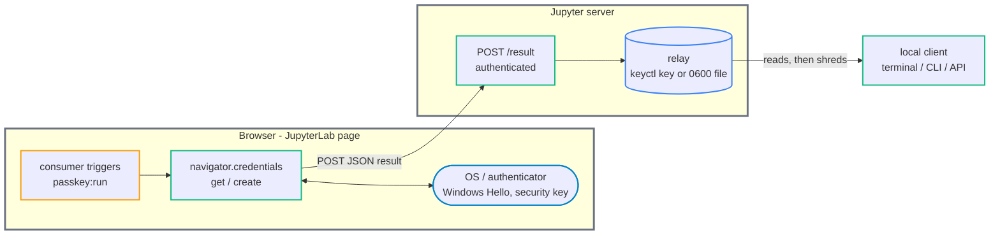
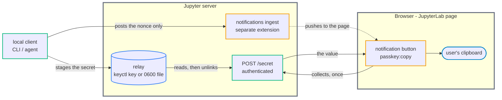

# jupyterlab_passkey_extension

[](https://github.com/stellarshenson/jupyterlab_passkey_extension/actions/workflows/build.yml)
[](https://www.npmjs.com/package/jupyterlab_passkey_extension)
[](https://pypi.org/project/jupyterlab-passkey-extension/)
[](https://pepy.tech/project/jupyterlab-passkey-extension)
[](https://jupyterlab.readthedocs.io/en/stable/)
[](https://kolomolo.com)
[](https://www.paypal.com/donate/?hosted_button_id=B4KPBJDLLXTSA)

A generic passkey bridge for JupyterLab. It exposes the passkey (WebAuthn) capability of the user's browser or operating system to local clients that have no browser of their own - the JupyterLab terminal, a script, a CLI, or an AI agent working on the Jupyter server. The extension runs the browser-side ceremony and hands the result back to the requesting local process.

The bridge commands are purpose-agnostic and perform no cryptography of their own. Every caller supplies its own parameters, and a tool that wants a WebAuthn PRF value keeps all key handling to itself. The extension also ships a [password vault](#vault) built on the bridge - the one part that encrypts and stores secrets.

The way in is the **CLI** (`jupyterlab-passkey`, shipped with the package). Behind it sits an authenticated **HTTP API** - not a second way in, but the return path the browser posts its result to, and the relay's contract.

## Features

- **Passkeys from a terminal** - Windows Hello, Touch ID, or a security key, reachable from a process that has no browser. The user approves in their open tab; the result returns to the caller as a blocking call
- **Enroll and unlock** - register a passkey (`create`) and assert it later (`get`)
- **Key material without a stored key** - `get --prf-salt` yields a deterministic 32-byte WebAuthn PRF. The same credential and salt always return the same bytes, so a vault can derive its key from it and store none
- **Take a secret from the user, without it entering the transcript** - `passphrase` prompts in the browser and prints only a _reference_ to the staged value (`keyctl:...` or `file:...`), never the value. It never crosses the terminal, the shell history, a process argument, or the CLI itself
- **Hand a secret to the user, without leaving one behind** - `copy` puts a value on the user's clipboard via a notification button. It rides a one-shot relay the server deletes as it reads, and never enters the notification itself
- **Show a code the page cannot be scraped for** - `show` displays a value the user must read and type elsewhere - a one-time authenticator code - as a server-rendered, distorted image. The code is absent from the notification, the page DOM as text, and the accessibility tree, and an OCR pass on a screenshot still has to beat the distortion
- **Works detached** - every command ignores `SIGHUP`, so a notification, popup or query raised by a backgrounded process keeps waiting for its click after the terminal that launched it has closed; the command that `vault exec` runs gets the `SIGHUP` handling the CLI was started with, so under `nohup` or `setsid` it outlives the terminal, and a hangup that arrived while `vault exec` still waited for the unlock click does not stop it: the command runs after the click, with no terminal for its output
- **A password vault in the lab** - a sidebar panel, `jupyterlab-passkey vault` commands and a Python `Vault` class over one encrypted vault the Jupyter server keeps, unlocked with a passkey or a recovery passphrase
- **Purpose-agnostic bridge** - the bridge commands do no cryptography and store no secret, and hold no opinion about what the passkey unlocks

### Working with an AI agent

The `passphrase` and `copy` features are what make this usable when an AI agent is at the keyboard. An agent can run `jupyterlab-passkey passphrase --once --prompt "GitHub token"`; the user types the token into a browser dialog, and the agent receives a reference it hands to a consumer - so the token never appears in the agent's output, its context, or the session transcript. In the other direction, `pass-cli get github/api ... | jupyterlab-passkey copy` moves a secret from a vault to the user's clipboard through a pipe between two processes, so the bytes never pass through the agent either.

The CLI's and the bridge subcommands' `--help` are written to be read by an agent, and each of those subcommands carries worked examples.

The repository carries an agent skill, [`.agents/skills/jupyterlab-passkey/SKILL.md`](.agents/skills/jupyterlab-passkey/SKILL.md). It tells an agent which vault and bridge commands keep a secret out of its output, and what each error asks for next. Agents that read `.agents/skills` find it in a clone of this repository; to make it available to Claude Code everywhere, link it into the skills directory from the clone:

```bash
ln -s "$PWD/.agents/skills/jupyterlab-passkey" ~/.claude/skills/jupyterlab-passkey
```

> [!IMPORTANT]
> This is not a sandbox, and it is not a defence against a hostile caller. Any process running as your uid can also read the relay it points at (a kernel key or a `0600` file). What it buys is that a secret is never _incidentally_ captured - not echoed to a terminal, not printed into a transcript, not left in `~/.bash_history` or a process argument, and not broadcast in a notification payload.

## How it works

A browser page can only talk back to the Jupyter server over HTTP, and a local process on that server cannot receive anything from the page directly. So the ceremony runs in the page, and its result returns through an authenticated endpoint that writes a relay - a `keyctl` key or an atomic `0600` file - the local client reads.

**Inbound** - a ceremony, browser to local client. `passkey:passphrase` takes the same shape, POSTing to `/passphrase` instead:


```mermaid
flowchart LR
    subgraph BROWSER["Browser - JupyterLab page"]
        direction TB
        TRIG["consumer triggers<br/>passkey:run"]
        CER["navigator.credentials<br/>get / create"]
        OS(["OS / authenticator<br/>Windows Hello, security key"])
        TRIG --> CER
        CER <--> OS
    end
    subgraph SERVER["Jupyter server"]
        direction TB
        EP["POST /result<br/>authenticated"]
        RELAY[("relay<br/>keyctl key or 0600 file")]
        EP --> RELAY
    end
    LOCAL["local client<br/>terminal / CLI / API"]
    CER -->|"POST JSON result"| EP
    RELAY -->|"reads, then shreds"| LOCAL

    style BROWSER stroke:#6b7280,stroke-width:3px
    style SERVER stroke:#6b7280,stroke-width:3px
    style TRIG stroke:#f59e0b,stroke-width:2px
    style CER stroke:#10b981,stroke-width:2px
    style OS stroke:#0284c7,stroke-width:2px
    style EP stroke:#10b981,stroke-width:2px
    style RELAY stroke:#3b82f6,stroke-width:2px
    style LOCAL stroke:#10b981,stroke-width:2px
```

**Outbound** - `copy` runs the same plumbing backwards: the local client writes and the server reads. The notification carries only a nonce (see [Security](#security)), raised through the notifications extension - which is how every button in either direction gets on screen:


```mermaid
flowchart LR
    LOCAL2["local client<br/>CLI / agent"]
    subgraph SERVER2["Jupyter server"]
        direction TB
        ING["notifications ingest<br/>separate extension"]
        RELAY2[("relay<br/>keyctl key or 0600 file")]
        EP2["POST /secret<br/>authenticated"]
        RELAY2 -->|"reads, then unlinks"| EP2
    end
    subgraph BROWSER2["Browser - JupyterLab page"]
        direction TB
        BTN["notification button<br/>passkey:copy"]
        CLIP(["user's clipboard"])
        BTN --> CLIP
    end
    LOCAL2 -->|"stages the secret"| RELAY2
    LOCAL2 -->|"posts the nonce only"| ING
    ING -.->|"pushes to the page"| BTN
    BTN -->|"collects, once"| EP2
    EP2 -->|"the value"| BTN

    style BROWSER2 stroke:#6b7280,stroke-width:3px
    style SERVER2 stroke:#6b7280,stroke-width:3px
    style LOCAL2 stroke:#10b981,stroke-width:2px
    style ING stroke:#f59e0b,stroke-width:2px
    style RELAY2 stroke:#3b82f6,stroke-width:2px
    style EP2 stroke:#10b981,stroke-width:2px
    style BTN stroke:#f59e0b,stroke-width:2px
    style CLIP stroke:#0284c7,stroke-width:2px
```

## Install

```bash
pip install jupyterlab_passkey_extension
```

## Command line

`jupyterlab-passkey` ships with the package and is the intended way in. It turns a browser ceremony into a blocking local call: it posts the notification carrying the request, waits for your click, and prints the result. A caller needs to know none of the relay contract below, beyond the reference `passphrase` hands it.

| Command      | Does                                      | Prints                                                        |
| ------------ | ----------------------------------------- | ------------------------------------------------------------- |
| `create`     | registers a new passkey                   | its `cred_id`                                                 |
| `get`        | asserts a passkey                         | the PRF (with `--prf-salt`) or the `cred_id`                  |
| `passphrase` | prompts you for a secret in the browser   | a **reference** (`keyctl:...` or `file:...`), never the value |
| `copy`       | puts a secret on your clipboard           | nothing - it posts a button and returns                       |
| `show`       | shows a code as a scraper-resistant image | nothing - it posts a button and returns                       |

Exit status is the contract: `0` succeeded, `1` refused, timed out, or could not reach the server, `2` an argument the parser rejects. Only the result goes to stdout, so `$(...)` captures it clean.

Enroll a passkey, then derive key material from it:

```bash
cred_id=$(jupyterlab-passkey create --rp-id lab.example.com)

salt=$(head -c32 /dev/urandom | base64 | tr '+/' '-_' | tr -d '=')
prf=$(jupyterlab-passkey get --rp-id lab.example.com --cred-id "$cred_id" --prf-salt "$salt")
```

Take a secret from the user and give it straight to a consumer, without it passing through the terminal:

```bash
# prints a reference - keyctl:<key> or file:<path> - which the consumer resolves
pass_ref=$(jupyterlab-passkey passphrase --prompt "Recovery passphrase") || exit 1
PASS_RECOVERY_REF="$pass_ref" pass-cli-open --ensure

# a token you paste rather than type - one field, no confirmation
tok_ref=$(jupyterlab-passkey passphrase --once --prompt "GitHub token") || exit 1
```

The `|| exit 1` matters: a prefix assignment does not propagate a command substitution's exit status, so `PASS_RECOVERY_REF=$(jupyterlab-passkey passphrase) pass-cli-open` would run the consumer with an empty reference after a timeout or a cancel.

Send a secret the other way, to the user's clipboard:

```bash
pass-cli get github/api --field password --quiet --no-clipboard \
  | jupyterlab-passkey copy --label "GitHub token"
```

`copy` reads from a file or stdin and returns immediately - the click is what collects it, one time only - so its exit code means _posted_, not _copied_. Add `--block` to wait until the browser collects the secret and delete it if that never happens; even then it means _collected_, not _pasted_, since the page writes the clipboard after the relay is already gone. It refuses a stdin that is a terminal, which would echo the secret into your scrollback.

Show a code the user must read and type elsewhere - an authenticator enrolment code - without the page being scrapeable for it:

```bash
printf '%s' "$totp_secret" | jupyterlab-passkey show --label "Authenticator code"
```

`show` renders the code to a distorted image server-side, so it never reaches the page as text - not the notification, the DOM, or the accessibility tree. The click shows the image; nothing is reported back.

Full flags in [docs/cli-reference.md](docs/cli-reference.md), or `jupyterlab-passkey <command> --help`.

## Vault

The extension also keeps a password vault. The Jupyter server holds it: the entries sit in one encrypted file, a passkey or the recovery passphrase unlocks it, and the panel, the CLI and Python code all reach the same unlocked vault through the server's authenticated API.

- **Encryption** - every entry, names included, is one AES-256-GCM ciphertext under a random 32-byte data key. The data key is wrapped once per keyslot: each passkey slot with `HKDF(PRF)`, the recovery slot with `Scrypt(passphrase)` (n=2^17, r=8, p=1). Any one slot opens the vault; the recovery slot is mandatory
- **File** - `$XDG_DATA_HOME/jupyterlab-passkey/vault.json` (`~/.local/share/...` by default), mode `0600`, every change written to a temp file and renamed over it under a file lock; `JLAB_PASSKEY_VAULT` in the Jupyter server's environment moves it (a leading `~` is the home directory)
- **Passkeys are per hostname** - a passkey opens the vault only from the hostname it was registered on, or a subdomain of it. Register one per hostname you open JupyterLab under, or unlock with the recovery passphrase
- **Unlock duration** - `unlockMinutes` under Passkey Vault in the Settings Editor, default 240, range 1 to 1440; it applies to every client

### Panel

The Vault panel sits in the right sidebar; the `sidebar` setting moves it left. It creates the vault, unlocks it with a passkey or the recovery passphrase, and lists entries grouped by category with a filter. A row shows the entry's name and username; clicking it opens the entry in a read-only popup with Edit, Delete (asks first) and Close. The password shows as dots until the eye button runs a passkey request, and the server returns the password only when the PRF that request sends opens one of the vault's passkey slots. The panel does not copy; `vault copy` and `vault show` in the CLI do. The cog icon opens the security view - the key holder and what it protects on this host, as short values whose tooltips explain them - and manages passkeys (each registration asks for a name, such as "Work laptop"), the recovery passphrase and the settings. Changing the recovery passphrase and registering a passkey each need a proof in the same step: a request with a passkey registered for this hostname, or the current recovery passphrase on a hostname with none or when that request gets no answer (the passkey is on another device, or lost) or the passkey gives no PRF. The proof is asked before the browser creates anything; the first passkey, registered while the vault is created, uses the passphrase just chosen. The proof asks the person at the screen at the moment of the change, so an unlocked vault left open is not enough. It is not a boundary against a process running as your user: while the vault is unlocked, such a process can read the data key from keyctl or gpg-agent, or use the Jupyter token to call `vault get`, and it can get a passkey's PRF through `passkey:run` with one click in the tab.

### Command line and Python

```bash
jupyterlab-passkey vault init                      # recovery passphrase, then a passkey
jupyterlab-passkey vault add github/api -u me      # password prompted, piped, or --generate
jupyterlab-passkey vault get github/api            # the password on stdout; unlocks if needed
jupyterlab-passkey vault copy github/api           # to the browser clipboard
jupyterlab-passkey vault exec --env GITHUB_TOKEN=github/api -- gh repo list
jupyterlab-passkey vault status                    # state, time left, key holder, each protection explained
```

```python
from jupyterlab_passkey_extension.vault import Vault

token = Vault().get("github/api")  # unlocks with the passkey (a notification) if locked
```

No command takes a secret as an option value. `copy` and `show` have the server stage the value for the existing clipboard and image flows, so it never enters the CLI process. `import FILE` adds entries from a JSON list and accepts pass-cli's `service` field as the name. Every subcommand: [docs/cli-reference.md](docs/cli-reference.md#vault).

### Where the unlocked key is kept

While the vault is unlocked its data key sits in a key holder - the first of these that works on the host:

| Holder      | Where                                                                                            | Needs                                                                                                                                                    |
| ----------- | ------------------------------------------------------------------------------------------------ | -------------------------------------------------------------------------------------------------------------------------------------------------------- |
| `keyctl`    | the kernel keyring, with a kernel-enforced expiry                                                | the `keyctl` command (keyutils), and a seccomp profile that allows `add_key`, `keyctl` and `request_key` - Docker's default profile blocks them; no root |
| `gpg-agent` | a gpg-agent of the vault's own, with its own GnuPG home; expiry from its `max-cache-ttl`         | GnuPG (`apt install gnupg`)                                                                                                                              |
| `memory`    | the Jupyter server process: `memfd_secret`, else `mlock` with `MADV_DONTDUMP`, else plain memory | nothing - this is the extension's own code                                                                                                               |

Each holder reports what it protects on the host - never in swap, never in crash dumps, expires on its own, locks on server restart, isolated from containers - measured where it can be rather than assumed. The first two describe the holder's own copy of the key: the Jupyter server also uses the key in ordinary memory for each request, which Python cannot wipe, so a copy can stay in the server process, and reach swap, until that memory is reused - even after a lock. `vault status` and `--debug` show all five; the panel's security view shows the first two and locks on server restart. When `auto` falls back to the extension's own code, it logs one line saying why gpg-agent was not used, and the panel shows the same line. `JLAB_PASSKEY_VAULT_HOLDER=keyctl|gpg-agent|memory` in the Jupyter server's environment pins the choice. Run `vault lock` before changing the holder or `JLAB_PASSKEY_VAULT`, or before removing the vault file: `lock` clears the key of the vault this server last unlocked and of the vault it points at now; a key held in keyctl or gpg-agent before a server restart that changed the holder or the vault file can stay until its unlock duration ends.

> [!WARNING]
> The kernel keyring is per uid and user namespace, not per container. On a host where several containers run as the same uid, allow keyctl only where every user has a distinct uid, or pin `JLAB_PASSKEY_VAULT_HOLDER=gpg-agent`. gpg-agent is isolated only while its socket is not on a home directory the other containers mount: without `/run/user/<uid>` the socket sits in its GnuPG home under `$XDG_STATE_HOME`, and `vault status` then reports it as not isolated.

## Server API

All endpoints live under the server base URL and require Jupyter authentication (`@tornado.web.authenticated` - a caller needs the Jupyter token or session).

| Method                 | Path                                                     | Purpose                                                                                                      |
| ---------------------- | -------------------------------------------------------- | ------------------------------------------------------------------------------------------------------------ |
| `POST`                 | `<base_url>/jupyterlab-passkey-extension/result`         | ceremony result → a relay, `<nonce>.json` (a kernel key or an atomic `0600` file); `204`                     |
| `POST`                 | `<base_url>/jupyterlab-passkey-extension/passphrase`     | `{nonce, passphrase}` → raw `<nonce>.pass`, or `{nonce, cancelled: true}` → a `<nonce>.cancel` marker; `204` |
| `POST`                 | `<base_url>/jupyterlab-passkey-extension/secret`         | `{nonce}` ← raw `<nonce>.secret`; `{"value": "..."}`, or `404` once collected                                |
| `POST`                 | `<base_url>/jupyterlab-passkey-extension/render`         | `{nonce}` ← raw `<nonce>.code`; `{"png": "<base64>"}`, or `404` once rendered                                |
| `GET`                  | `<base_url>/jupyterlab-passkey-extension/health`         | `{ "ok": true }`                                                                                             |
| `GET`, `POST`, `PATCH` | `<base_url>/jupyterlab-passkey-extension/vault/<action>` | the [vault](#vault): `423` while locked; bodies, values and PRFs never logged                                |

Every relay `POST` answers `400` on a bad nonce and touches no file when it does. The nonce is the relay filename, so it must match `[A-Za-z0-9_-]{16,128}`. Bodies and values are never logged.

`secret` and `render` are the endpoints that read rather than write: a local client stages the value, or the server does for `vault copy` and `vault show`. They are `POST`s despite only reading: the read is destructive, and a `GET` would carry the nonce in the query string straight into the server's access log.

### The relay contract

- **Directory** - `/dev/shm/jlab-passkey-$(id -u)`, mode `0700`, ownership verified before every read and write; override with `JLAB_PASSKEY_RELAY_DIR`
- **Files** - `<nonce>.json` (ceremony result), raw `<nonce>.pass` (captured secret), raw `<nonce>.secret` (secret going out to the clipboard), raw `<nonce>.code` (code going out to be shown as an image), `<nonce>.cancel` (no secret: a dismissed passphrase dialog, for the consumer to stop waiting)
- **Mode** - `0600`, written `mkstemp`-then-`os.replace`, so a reader never sees a partial write
- **Lifecycle** - the consumer shreds `.json` and `.pass`, and removes a `.cancel` it saw; `.secret` and `.code` are server-enforced one-shot, unlinked as they are read

```jsonc
// passkey:run - create success
{ "nonce": "...", "ok": true, "cred_id": "<b64url>", "prf_enabled": false }

// get success (prf present only when prf_salt was supplied and evaluated)
{ "nonce": "...", "ok": true, "cred_id": "<b64url>", "prf": "<b64url>" }

// failure
{ "nonce": "...", "ok": false, "error": "no-prf" | "not-allowed" | "rp-id-mismatch" | "error: <name>" | "error" }
```

`create` never rejects on the create-time PRF flag - it always returns `cred_id` and a plain `prf_enabled`. Some authenticators (Windows Hello) report `prf_enabled: false` at registration yet yield a real PRF at assertion, so PRF availability is confirmed by a follow-up `get` with a `prf_salt`. `not-allowed` is WebAuthn's deliberate conflation of user-cancel, no-matching-credential, and wrong-RP into one privacy-preserving code. `rp-id-mismatch` is separate and nameable: a synchronous `SecurityError` thrown when `rp_id` is not a registrable suffix of the tab's origin, or the tab is at an IP address in a secure context (a loopback address such as 127.0.0.1, or HTTPS), so the CLI reports that `--rp-id` does not match the tab's URL rather than a bare `error`. A tab on plain HTTP at any other address has no WebAuthn at all and answers `error`.

## For extension authors: the frontend commands

Six JupyterLab commands POST to the API above. Reach for them only when writing an extension that triggers a ceremony itself; everything else is better served by the CLI.

| Command                  | Args                                                     | Does                                                                                                                                                                       |
| ------------------------ | -------------------------------------------------------- | -------------------------------------------------------------------------------------------------------------------------------------------------------------------------- |
| `passkey:run`            | `op`, `nonce`, `rp_id`, `cred_id?`, `prf_salt?`, `user?` | runs the ceremony and POSTs the result to `/result`                                                                                                                        |
| `passkey:passphrase`     | `nonce`, `prompt?`, `once?`                              | opens the dialog and POSTs the value to `/passphrase`                                                                                                                      |
| `passkey:copy`           | `nonce`, `label?`                                        | collects a staged secret from `/secret` and writes it to the clipboard                                                                                                     |
| `passkey:show`           | `nonce`, `label?`                                        | fetches a rendered image of a staged code from `/render` and shows it                                                                                                      |
| `passkey:vault-unlock`   | `nonce?`                                                 | unlocks the vault with a passkey for this hostname; answers `ok`, or `error` with a sentence, on `/result`                                                                 |
| `passkey:vault-register` | `nonce?`, `label?`                                       | takes a proof (a passkey for this hostname, else the recovery passphrase), then registers a passkey with the vault; answers `ok`, or `error` with a sentence, on `/result` |

`passkey:run` reaches `navigator.credentials.*` before any `await`, so the trigger's user gesture survives into the ceremony. The challenge is a random 32-byte value the frontend generates itself - anti-replay plumbing nothing here verifies, so callers never supply it.

WebAuthn requires a user gesture, and this extension builds no request-submission UI of its own - that is the consumer's job. The reference trigger is a [`jupyterlab-notify`](https://github.com/stellarshenson/jupyterlab_notifications_extension) notification whose action button is bound to the command; the click supplies the gesture and reaches the command with the app already in hand. This is what the CLI does for you.

```bash
jupyterlab-notify --now --no-auto-close -t info \
  -m "Approve passkey" \
  --action "Approve" \
  --cmd "passkey:run" \
  --command-args '{"op":"get","nonce":"<16-128 url-safe chars>","rp_id":"lab.example.com","cred_id":"<b64url>","prf_salt":"<b64url>"}'
```

> [!NOTE]
> Do not start JupyterLab with `--expose-app-in-browser` just to trigger the command by hand. A notify button (or any extension that holds the app reference) reaches `passkey:run` directly with a genuine gesture and no global.

Full argument, relay, and endpoint reference in [docs/commands-reference.md](docs/commands-reference.md); a worked consumer walkthrough that seals and opens a secret with a passkey in [docs/example-secret-unlock.md](docs/example-secret-unlock.md).

## Security

- Every endpoint, the vault's included, is gated by `@tornado.web.authenticated` - a caller needs the Jupyter token or session
- A secret is staged in one of two relay backends, chosen per process. The preferred is a uid-scoped kernel `keyctl` key: it never swaps to disk and the kernel destroys it at a TTL, so nothing survives a crash. The fallback is a `/dev/shm` `0600` file, created `mkstemp` + `os.replace` (a fresh file with no world-readable window, renamed onto its `<nonce>` name atomically, never appended to). Force the choice with `JLAB_PASSKEY_RELAY_BACKEND=keyctl|shm|auto`
- **Neither backend isolates a secret from your own processes.** `--alswrv` grants your uid on the key, and the file is `0600` under your uid, so any process you run can read either. keyctl's win is no swap, self-destruct and no disk artifact, not access control; the same-uid exposure is unchanged from the file
- Single-read is the consumer's responsibility for the ceremony and passphrase relays - the server does not destroy those, so a consumer reads once and (shm) shreds. The `copy` and `show` relays are the exceptions: the server reads and destroys each together, so collection is a server-enforced one shot
- A secret never enters a notification. The notifications extension pushes every payload to each connected socket and holds it in an in-memory queue until a client drains it, so what travels there is a nonce - useless without the Jupyter token that collects it
- On the shm fallback the relay directory's path is uid-scoped but predictable, and `/dev/shm` is world-writable (`1777`), so squatting it is checked rather than assumed away: before any read or write, the directory must be a real directory (not a symlink) owned by the current uid - anything foreign raises instead of falling back, so a co-tenant who gets there first is refused, not followed. A loose mode on a directory that is ours is tightened to `0700`, not refused. The keyctl path has no filesystem to squat
- The result body, the passphrase, and any PRF value are never written to logs, and a keyctl payload rides stdin, never a process argument
- The bridge performs no cryptography and stores no secret; every parameter and all key handling belong to the caller. The [vault](#vault) is the one part that encrypts and stores secrets, and its unlock sends the PRF from the page straight to the server - never through the CLI or a relay
- Once a secret reaches the clipboard it is an OS-wide value, readable by any application until overwritten - inherent to `copy`'s purpose, and the reason nothing else here touches the clipboard
- `show` renders a staged code to a distorted PNG server-side and returns only image bytes, so the code is absent from the notification, the page DOM as text, and the accessibility tree (the dialog image carries empty `alt` text by design). This raises the bar against a screen scraper and an OCR pass, but a value shown on screen is inherently visible to whoever can see or screenshot the screen - it is defence in depth, not a secrecy guarantee
- Every command ignores `SIGHUP`, so a backgrounded process keeps waiting for its click after its terminal closes; a detached run works the same as an attached one, and nothing about detaching weakens the token gate or the relay. The command that `vault exec` runs is the exception: it gets the `SIGHUP` handling the CLI was started with, so under `nohup` or `setsid` it outlives the terminal; a hangup that arrived while `vault exec` still waited for the unlock click does not stop it, and the command runs after the click with no terminal for its output

## Requirements

- JupyterLab >= 4.0.0, opened by name - over HTTPS, or at localhost - WebAuthn needs a secure context, and a passkey belongs to a hostname, never an IP address such as 127.0.0.1
- An open JupyterLab tab on the same server. The click in it is the user gesture WebAuthn requires, and a terminal has none
- [`jupyterlab_notifications_extension`](https://github.com/stellarshenson/jupyterlab_notifications_extension) - a hard dependency, installed for you. The CLI posts to its `ingest` endpoint to raise the button
- A passkey authenticator for `create` and `get`: Windows Hello, Touch ID, a security key, or a browser password manager. `passphrase`, `copy` and `show` need none
- GnuPG for the vault (`apt install gnupg`), so gpg-agent can hold the unlocked key where the kernel keyring is not allowed. Without it the vault still works: the extension's own code holds the key in server memory, and it says so

## Development install

```bash
# from a clone of this repository
pip install -e "."
jupyter labextension develop . --overwrite
jlpm build
```

Rebuild after changes with `jlpm build`, or run `jlpm watch` in one terminal alongside JupyterLab. See [CONTRIBUTING.md](CONTRIBUTING.md) for the full development, testing, and release workflow.

## Uninstall

```bash
pip uninstall jupyterlab_passkey_extension
```

## License

BSD-3-Clause. See [LICENSE](LICENSE).
