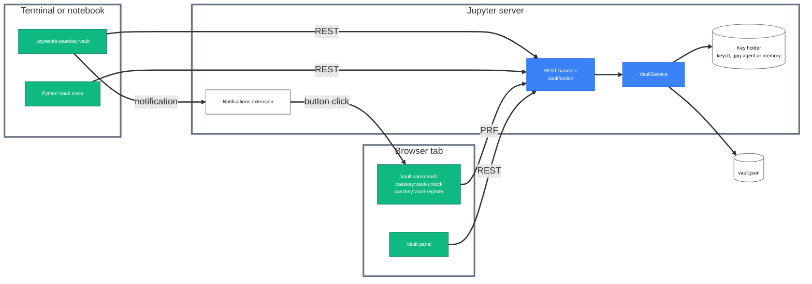
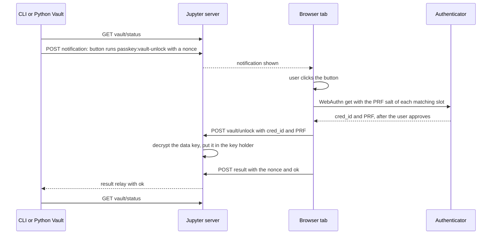

# jupyterlab_passkey_extension - Password vault design v1

Status: current for release 1.1.2, 2026-09-29.

## Contents

- [1. Overview](#1.-Overview)
- [2. Components](#2.-Components)
- [3. Vault file](#3.-Vault-file)
  - [3.1 File format](#3.1-File-format)
  - [3.2 Encryption and slots](#3.2-Encryption-and-slots)
  - [3.3 Writes](#3.3-Writes)
- [4. Unlock and lock](#4.-Unlock-and-lock)
  - [4.1 Unlock paths](#4.1-Unlock-paths)
  - [4.2 Key holders](#4.2-Key-holders)
  - [4.3 Unlock duration and lock](#4.3-Unlock-duration-and-lock)
- [5. Passkeys and hostnames](#5.-Passkeys-and-hostnames)
- [6. Proof requirements](#6.-Proof-requirements)
- [7. Reading values](#7.-Reading-values)
- [8. REST API](#8.-REST-API)
- [9. Clients](#9.-Clients)
  - [9.1 CLI](#9.1-CLI)
  - [9.2 Python API](#9.2-Python-API)
  - [9.3 Panel](#9.3-Panel)
- [10. Security limits](#10.-Security-limits)
- [11. Configuration](#11.-Configuration)

## 1. Overview

This section states what the vault is and which parts take part in it. The vault is one encrypted file of passwords per user. The Jupyter server keeps it, and a passkey or a recovery passphrase opens it.

- **One owner of the file** - only the Jupyter server process reads and writes the vault file; every client calls its REST API
- **Three clients** - the `jupyterlab-passkey vault` CLI, the Python `Vault` class and the sidebar panel
- **Two ways in** - a passkey registered for the hostname of the browser tab, or the recovery passphrase
- **One unlock for all clients** - an unlock keeps the data key for the unlock duration (default 240 minutes), and the CLI, the Python class and the panel all use that one unlock
- **Passkey steps run in the tab** - WebAuthn runs only in a browser tab after a click, so the CLI and the Python class raise a notification, and its button starts the passkey step in the tab



_Fig 1 - Vault components and the calls between them_

## 2. Components

This section lists the modules of the vault and the job of each. Paths are relative to the repository root.

| Component                  | Location                                         | Description                                                                       |
| -------------------------- | ------------------------------------------------ | --------------------------------------------------------------------------------- |
| File format and encryption | `jupyterlab_passkey_extension/vault/store.py`    | reads, encrypts and writes `vault.json`                                           |
| Key holders                | `jupyterlab_passkey_extension/vault/holders.py`  | keep the data key while the vault is unlocked                                     |
| Vault service              | `jupyterlab_passkey_extension/vault/service.py`  | unlock, lock, entries, slots and proofs; the only code that opens the file        |
| REST handlers              | `jupyterlab_passkey_extension/vault/handlers.py` | map each `vault/<action>` request to the service                                  |
| Client                     | `jupyterlab_passkey_extension/vault/client.py`   | REST calls and the notification step, shared by the CLI and the Python class      |
| CLI                        | `jupyterlab_passkey_extension/vault/cli.py`      | the `jupyterlab-passkey vault` subcommands                                        |
| Panel                      | `src/vault/panel.ts`, `src/vault/dialogs.ts`     | entry list, entry forms, and the settings and security view (the cog)             |
| Passkey steps              | `src/vault/webauthn.ts`                          | registration, unlock, reveal and proof requests to the authenticator              |
| Commands                   | `src/vault/plugin.ts`                            | `passkey:vault-unlock` and `passkey:vault-register`, run by a notification button |

## 3. Vault file

This section describes the file on disk, how its contents are encrypted, and how a change is written. The file is `$XDG_DATA_HOME/jupyterlab-passkey/vault.json` (`~/.local/share/jupyterlab-passkey/vault.json` by default), or the path in `JLAB_PASSKEY_VAULT`.

### 3.1 File format

The file is one JSON document with format version 1.

```json
{
  "format": "jupyterlab-passkey-vault",
  "version": 1,
  "id": "<16 hex characters>",
  "slots": [
    {
      "type": "recovery",
      "kdf": "scrypt",
      "n": 131072,
      "r": 8,
      "p": 1,
      "salt": "<base64>",
      "wrapped": "<base64>"
    },
    {
      "type": "passkey",
      "cred_id": "<base64url>",
      "rp_id": "<hostname>",
      "prf_salt": "<base64url>",
      "hkdf_salt": "<base64>",
      "created": "<ISO 8601 UTC>",
      "wrapped": "<base64>",
      "label": "<text>"
    }
  ],
  "entries": "<base64: 12-byte nonce + AES-256-GCM ciphertext>"
}
```

- **`id`** - random per vault; it names the data key in the key holder, so two vaults of one user never read each other's key
- **`slots`** - one recovery slot and zero or more passkey slots
- **`entries`** - all entries, names included, encrypted as one JSON list
- **Entry fields** - `name`, `username`, `password`, `url`, `category`, `notes`, `created`, `updated`
- **Limits** - a name is at most 200 printable characters; a field is at most 65,536 characters

### 3.2 Encryption and slots

The data key is 32 random bytes that encrypt the entries. Each slot holds one copy of the data key, encrypted under a key derived from one secret.

| Item          | Encrypted under               | Algorithm                                                                                                |
| ------------- | ----------------------------- | -------------------------------------------------------------------------------------------------------- |
| Entries       | the data key                  | AES-256-GCM, 12-byte nonce                                                                               |
| Recovery slot | the recovery passphrase       | scrypt with n = 131,072, r = 8, p = 1 and a 16-byte salt (128 MiB of memory per guess), then AES-256-GCM |
| Passkey slot  | the PRF output of the passkey | HKDF-SHA256 with a 16-byte salt, then AES-256-GCM                                                        |

- **PRF** - the WebAuthn PRF extension: the authenticator returns 32 bytes computed from the passkey and the slot's `prf_salt`; the same passkey and salt always return the same bytes
- **Any slot opens the vault** - every slot holds the same data key
- **Slot changes leave the entries as they are** - adding or removing a slot never re-encrypts the entries
- **Slot fields are authenticated** - every slot field except `wrapped` and `label` is bound to the encryption as associated data, so a changed salt, cost, credential id or hostname fails to open
- **Cost per slot** - each recovery slot stores its own scrypt parameters, so a higher cost for new slots leaves existing slots readable

### 3.3 Writes

Every change is a read, a change and a write under one exclusive lock.

- **Lock** - `flock` on `<vault>.lock` beside the file
- **Write** - a temporary file in the same directory, `fsync`, mode `0600`, rename over the vault, `fsync` of the directory
- **Wrong key** - a write first decrypts the current entries with the data key it holds, so a wrong key never overwrites the file
- **Directory** - created with mode `0700` when it does not exist

## 4. Unlock and lock

This section describes how the server takes the data key out of a slot, where it keeps the key, and how the key is removed.

### 4.1 Unlock paths

The server decrypts the data key from one slot and puts it in the key holder for the unlock duration. Three requests do this.

- **Passkey** - the tab sends one WebAuthn request that offers the passkeys registered for its hostname (section 5), each with its own `prf_salt`; it then sends the `cred_id` and the PRF to `POST vault/unlock`
- **Recovery passphrase** - `POST vault/unlock` with the passphrase; the CLI reads it from a hidden prompt, from stdin, or from a browser dialog with `--in-browser`
- **Create** - `POST vault/init` creates the vault and leaves it unlocked

When the CLI or the Python class starts a passkey unlock, the PRF goes from the tab to the vault endpoint. The result relay (a kernel key, or a `0600` file in `/dev/shm`) carries only `ok` or the error line back to the CLI.



_Fig 2 - A passkey unlock started from the CLI_

### 4.2 Key holders

The server keeps the data key in the first key holder that works on the host, tried in the order keyctl, gpg-agent, memory. Hosts differ: a seccomp profile can forbid the kernel keyring, and GnuPG can be missing.

| Capability               | keyctl              | gpg-agent                                                                 | memory                                     |
| ------------------------ | ------------------- | ------------------------------------------------------------------------- | ------------------------------------------ |
| Where the key is         | kernel keyring `@u` | a gpg-agent with its own GnuPG home                                       | Jupyter server process memory              |
| Never in swap            | yes                 | measured on the agent process                                             | yes with `memfd_secret` or `mlock`         |
| Never in crash dumps     | yes                 | measured on the agent process                                             | yes with `memfd_secret` or `MADV_DONTDUMP` |
| Expires on its own       | yes, kernel timeout | yes, agent `max-cache-ttl`                                                | no, a timer in the server removes it       |
| Locks on server restart  | no                  | no                                                                        | yes                                        |
| Isolated from containers | no                  | yes when the agent socket is outside `$XDG_STATE_HOME/jupyterlab-passkey` | yes                                        |

- **Choice** - `JLAB_PASSKEY_VAULT_HOLDER` pins `keyctl`, `gpg-agent` or `memory`; a pinned holder that does not work is an error
- **keyctl test** - keyctl is chosen only after a real add, search and read of a test key succeeds
- **gpg-agent** - a separate agent under `$XDG_STATE_HOME/jupyterlab-passkey/gnupg`, never the user's `~/.gnupg` one, because its `max-cache-ttl` would change the user's own gpg and ssh caching
- **Protection level** - `strong` when the key is kept out of swap and out of crash dumps, `reduced` with one of the two, `basic` with neither
- **Shown to the user** - `vault status` and the cog view show the chosen holder and each capability; when the memory holder is chosen, the server logs why gpg-agent was skipped and the panel shows the same line

### 4.3 Unlock duration and lock

This subsection covers how long a key stays and what removes it earlier.

- **Duration** - the `unlockMinutes` setting, 1 to 1,440 minutes, default 240
- **Storage** - the panel sends the setting to `POST vault/config`, and the server stores it in `$XDG_STATE_HOME/jupyterlab-passkey/vault-config.json`
- **When it applies** - at the next unlock from any client; a key already held keeps its expiry
- **Lock** - `vault lock`, `Vault.lock()` or the panel's Lock button removes the key from the holder
- **Server restart** - with keyctl or gpg-agent the key can stay held after a restart until the duration ends; with the memory holder a restart locks the vault

## 5. Passkeys and hostnames

This section describes which hostname a passkey belongs to. WebAuthn binds each passkey to one relying-party id (RP ID), and the vault uses the hostname of the browser tab as that id.

- **Source of the hostname** - the tab reads `location.hostname` for registration, unlock, reveal and proof; the server stores the `rp_id` the tab sends
- **Proxies** - the server reads no `Host` or `X-Forwarded-Host` header, so a server on localhost behind a chain of proxies records the hostname in the user's address bar
- **Scope** - a passkey opens the vault from its hostname or from a subdomain of it
- **Most specific hostname** - WebAuthn takes one RP ID per request, so the tab offers the passkeys of the longest registered hostname that matches
- **One passkey per hostname** - JupyterLab opened at two hostnames needs a passkey registered at each
- **IP address** - a tab at an IP address such as `127.0.0.1` cannot use a passkey; the tab refuses and names the hostnames that have passkeys
- **Two requests to register** - a WebAuthn `create` makes the passkey, then a `get` with a new random `prf_salt` returns the PRF, because some authenticators, Windows Hello among them, return a PRF only at `get`
- **Two dialogs to register** - the user names the passkey in a dialog before the `create`, and confirms it in a second dialog before the `get`; each button is the click the browser needs for its request
- **Name in the passkey manager** - `JupyterLab vault - <UTC time> - <hostname>`, so two passkeys of one vault can be told apart
- **No PRF** - an authenticator that returns no PRF cannot hold a vault key; the registration fails and names the passkey the browser created, so the user can delete it

## 6. Proof requirements

This section lists which requests need a proof. A proof is a passkey answer (`cred_id` and PRF) or the current recovery passphrase, sent with the request; the server decrypts the data key from it instead of taking the key from the holder. Every request also needs the Jupyter server token.

| Request                            | Needs                 |
| ---------------------------------- | --------------------- |
| Add a passkey                      | a proof               |
| Replace the recovery passphrase    | a proof               |
| Show a password in the panel       | a new passkey request |
| Remove a passkey                   | an unlocked vault     |
| Read, add, edit or delete an entry | an unlocked vault     |
| Change the unlock duration         | nothing more          |

- **Why a proof** - a new passkey and a new recovery passphrase each open the vault later, and an unlocked vault proves nothing about who asks now
- **Order in the tab** - a passkey registered for the tab's hostname first; the recovery passphrase when there is none, or when the passkey request is refused or returns no PRF
- **No relay** - the tab asks for the proof itself, so no secret reaches the page through a relay

## 7. Reading values

This section describes the path each value takes out of the vault. A listing never carries passwords.

| Request                     | Path of the value                                               | Where it ends                                                       |
| --------------------------- | --------------------------------------------------------------- | ------------------------------------------------------------------- |
| `vault get`, `Vault.get()`  | REST answer to the client process                               | stdout of the CLI, or a Python string                               |
| `vault exec --env VAR=NAME` | REST answer to the CLI process                                  | the environment of the command; the CLI process becomes the command |
| `vault copy`                | server stages it in the relay; the tab collects it on the click | the browser clipboard                                               |
| `vault show`                | server stages it in the relay; the tab collects it on the click | a distorted image in the tab                                        |
| Panel eye button            | new passkey request, then `POST vault/reveal` with the PRF      | the entry dialog                                                    |
| `vault list`, panel list    | REST answer                                                     | names and fields without passwords                                  |

- **copy and show** - the value never enters the CLI process
- **Staged value lifetime** - 900 s as a kernel key, or until the next reboot as a file in `/dev/shm` when keyctl does not work; `vault lock` does not remove a staged value
- **Relay** - the same one-shot relay as the bridge commands `copy`, `show` and `passphrase` (`jupyterlab_passkey_extension/relay.py`)

## 8. REST API

This section lists the endpoints. Each is `<base_url>/jupyterlab-passkey-extension/vault/<action>`, requires the Jupyter server token, and never logs a body, a value or a result.

| Method | Action            | Body or query                                             | Answer                    |
| ------ | ----------------- | --------------------------------------------------------- | ------------------------- |
| GET    | `status`          | -                                                         | state, see below          |
| GET    | `entries`         | -                                                         | entries without passwords |
| GET    | `generate`        | `length` (8 to 256, default 24), `symbols` (`0` for none) | a new password            |
| POST   | `config`          | `unlock_minutes`                                          | 204                       |
| POST   | `init`            | `recovery`                                                | 204                       |
| POST   | `unlock`          | `recovery`, or `cred_id` and `prf`                        | state                     |
| POST   | `lock`            | -                                                         | 204                       |
| POST   | `entries`         | `name`, `fields`                                          | 204                       |
| PATCH  | `entries`         | `name`, `fields`; only the fields given change            | 204                       |
| POST   | `delete`          | `name`                                                    | 204                       |
| POST   | `reveal`          | `name` and `field`, or `name`, `cred_id` and `prf`        | `value`                   |
| POST   | `stage`           | `name`, `field`, `kind` (`secret` or `code`)              | `nonce`                   |
| POST   | `import`          | `entries`, a list of entry objects                        | `added`, `skipped`        |
| POST   | `passkeys`        | `cred_id`, `rp_id`, `prf_salt`, `prf`, `label`, `proof`   | 204                       |
| POST   | `passkeys-remove` | `cred_id`                                                 | 204                       |
| POST   | `recovery`        | `recovery`, `proof`                                       | 204                       |

- **State** - `initialized`, `unlocked`, `remaining` seconds, `holder` with its capabilities, slot fields without the wrapped keys and salts, `settings`, `path`, `revision`
- **`revision`** - the first 16 hex characters of a SHA-256 of the encrypted entries; it changes with every entry change, and it tells nothing about the entries
- **Generated password** - leaves out `l I 1 | O 0`, quotes, backslash, backtick and space, because a user reads it off an image or types it on a phone
- **Errors** - the body is `{"error": "<one line>"}` with the status below

| Status | Meaning                                                                                 |
| ------ | --------------------------------------------------------------------------------------- |
| 400    | refused: wrong passphrase or passkey at unlock, invalid input, no vault file            |
| 403    | the proof did not open the vault                                                        |
| 404    | no entry with that name, or no such action                                              |
| 409    | an entry with that name exists                                                          |
| 423    | the vault is locked                                                                     |
| 500    | a key holder or file failure; the log line names the action and the exception type only |

## 9. Clients

This section describes what each client adds to the REST API.

### 9.1 CLI

The CLI is `jupyterlab-passkey vault <command>`. Its full reference is [cli-reference.md](cli-reference.md).

- **Server** - the first server that `jupyter server list` reports, with that server's token
- **No secret on the command line** - a new secret comes from a hidden prompt typed twice, from stdin, from a browser dialog with `--in-browser`, or from `--generate`
- **Locked vault** - a read raises the unlock notification, then runs once more
- **Waiting** - a browser step waits 120 s for the click by default, 600 s for `vault init` and `vault passkey add`
- **Agent skill** - `.agents/skills/jupyterlab-passkey-extension/SKILL.md`, also installed with the wheel, points an agent at `--help` and states which commands keep a value out of its output

### 9.2 Python API

The `Vault` class in `jupyterlab_passkey_extension.vault` uses the same REST calls as the CLI.

- **Methods** - `status()`, `list()`, `get(name, field="password")`, `unlock(recovery=None)`, `lock()`
- **Locked vault** - `get()` and `list()` raise the unlock notification, then run once more
- **Refusal** - raises `VaultClientError` with the one-line reason

### 9.3 Panel

The panel sits in the right sidebar by default; the `sidebar` setting moves it to the left.

- **Refresh** - while visible, it reads the state and, when unlocked, the entry list every 15 s, and at once when it is shown again
- **Changes from elsewhere** - a new `revision` or a changed slot list redraws the panel, so changes made from the CLI or another tab appear
- **Eye button** - a password shows only after a new passkey request, even when the vault is unlocked; while that request runs the eye shows a spinner and the line under the field reads `Waiting for your passkey`
- **Cog view** - the key holder and its capabilities, the passkeys with hostname and date, register and remove a passkey, change the recovery passphrase, and the unlock duration with a button that opens the settings

## 10. Security limits

This section states what the vault does not protect against.

- **Jupyter token** - any process that has the token can read every entry while the vault is unlocked; `jupyter server list` shows the token to every process of the same user
- **Copied file** - a copy of `vault.json` can be attacked offline through the recovery slot; scrypt makes each guess cost 128 MiB of memory, and a weak passphrase can still be guessed
- **Shared keyring** - with the keyctl holder, other containers that run as the same user id in the same user namespace can read the held key
- **Staged values** - an uncollected `copy` or `show` value outlives `vault lock`, see [7. Reading values](#7.-Reading-values)
- **Restart** - with keyctl or gpg-agent a key can outlive a server restart until the unlock duration ends
- **Two servers** - the CLI uses the first server; with two servers the notification can appear in a tab nobody watches, and the command times out

## 11. Configuration

This section lists the settings and environment variables of the vault. The server reads the environment variables, so they are set where the server starts.

| Setting                     | Default                                        | Effect                                                  |
| --------------------------- | ---------------------------------------------- | ------------------------------------------------------- |
| `JLAB_PASSKEY_VAULT`        | `$XDG_DATA_HOME/jupyterlab-passkey/vault.json` | path of the vault file                                  |
| `JLAB_PASSKEY_VAULT_HOLDER` | `auto`                                         | pins the key holder                                     |
| `XDG_STATE_HOME`            | `~/.local/state`                               | parent of the gpg-agent home and of `vault-config.json` |
| `unlockMinutes`             | 240                                            | unlock duration in minutes, 1 to 1,440                  |
| `sidebar`                   | `right`                                        | sidebar that holds the panel                            |
